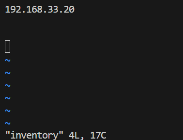
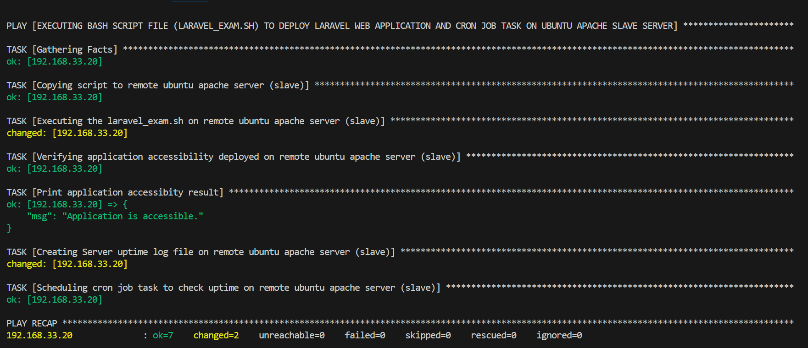

## DEPLOYING LAMP STACK VIA BASHSCRIPT AND ANSIBLE PLAYBOOK ON A REMOTE UBUNTU APACHE SERVER (SLAVE) 

This guide provides detailed instructions for deploying a Laravel web application on a remote Ubuntu server acting as a slave to a master server. The master server manages the deployment process, while the slave server hosts the Laravel application. We'll use a combination of bash script and Ansible playbook for the deployment.
**Prerequisites:**
1. Virtual machine/box and vagrant installed
1. Master server and remote slave server configured and deployed via vagrant
1. Laravel application codebase stored in a Git repository
1. SSH access to both the master and slave servers

### Vagrant master vagrantfile
---
create a parent folder called Vagrant and a sub dir named Master and open up the dir with git bash and write the command: 
- `vagrant init ubuntu/focal64`

configure the vagrant@master vagrantfile as follows and configure add provisioning for ansible:
```
# -*- mode: ruby -*-
# vi: set ft=ruby :
Vagrant.configure("2") do |config|
  config.vm.define"ansible-master" do |master|
  master.vm.hostname="master"
end

  config.vm.box = "ubuntu/focal64"
  config.ssh.insert_key = false

   config.vm.network "forwarded_port", guest: 80, host: 8080, auto_correct: true
   config.vm.usable_port_range = (8000..9000)

   config.vm.network "private_network", ip: "192.168.33.10", type:"dhcp"

   config.vm.network "public_network"

  # View the documentation for the provider you are using for more
  # information on available options.

  # Enable provisioning with a shell script. Additional provisioners such as
  # Ansible, Chef, Docker, Puppet and Salt are also available. Please see the
  # documentation for more information about their specific syntax and use.
   config.vm.provision "shell", inline: <<-SHELL
     apt-get update -y
     sudo apt install ansible -y
     sudo apt install ansible-lint -y
  #   apt-get install -y apache2
   SHELL
end
```
### Vagrant slave vagrantfile
---
create sub folder insider the vagrant dir called Slave, open up the dir with git bash and write the command: 
- `vagrant init`
configure the vagrant@slave vagrantfile as follows and configure add provisioning for ansible:
```
# -*- mode: ruby -*-
# vi: set ft=ruby :
Vagrant.configure("2") do |config|
  config.vm.define"ansible-slave" do |slave|
  slave.vm.hostname="slave"
end

  config.vm.box = "ubuntu/focal64"
  config.ssh.insert_key = false

   config.vm.network "forwarded_port", guest: 80, host: 8080, auto_correct: true
   config.vm.usable_port_range = (8000..9000)

   config.vm.network "private_network", ip: "192.168.33.20", type:"dhcp"

   config.vm.network "public_network"

  # View the documentation for the provider you are using for more
  # information on available options.

  # Enable provisioning with a shell script. Additional provisioners such as
  # Ansible, Chef, Docker, Puppet and Salt are also available. Please see the
  # documentation for more information about their specific syntax and use.
  # config.vm.provision "shell", inline: <<-SHELL
  #   apt-get update -y
  #   sudo apt install ansible -y
  #   sudo apt install ansible-lint -y
  #   apt-get install -y apache2
  # SHELL
end
```
### Booting up machines
open up virtual box and and open two git bash terminal to acces the vagrant master amd vagrant slave. its required after configuring the vagrantfiles for both instances inside git bash that you validate the vagrantfile and boot up the vagrant image for both vagrant instances with the following commands: 

Master directory
1. `vgrant validate`
1. `Vagrant up`
1. `vagrant ssh`

Slave directory
1. `vagrant validate`
1. `vagrant up`
1. `vagrant ssh`

### ssh from vagrant@master to vagrant@slave
After successfully booting up the machines (master and slave), inside the master write the command to create the ssh key to be used on the vagrant@slave
- `vagrant@master:~$ ssh-keygen -t ed25519 -C "Master-ssh"`
- `vagrant@master:~$ cd .ssh`
- `vagrant@master:~/.ssh$ ls`
- `vagrant@master:~/.ssh$ cat id_ed25519.pub`

[ssh-heygen](./ssh2.png)

copy the public key created inside the id_ed25519.pub file into the vagrant@slave authorized_key file, which can be found in the .ssh dir uisng the command inside the ansible node machines

**vagrant slave/nodes machine:**
- `vagrant@slave:~$ cd .ssh`
- `vagrant@slave:~/ .ssh$ ls`
- `vagrant@slave:~/ .ssh$ sudo vi authorized_keys`


  

The vagrant@master can therefore ssh into the nodes using username of the slave node and ip address. the command is as follows:
`vagrant@master:~$ ssh vagrant@192.168.33.20`
- changes to: `vagrant@slave:~$`

### Creation of project directory and files inside the directory
---
Create a directory inside called server_deploy in the vagrant@master machine containing the following files, playbook.yml, laravel_exam.sh, and inventory.
The dir is created with the command:
- `vagrant@master:~$ mkdir /home/vagrant/server_deploy`
inside the server_deploy directory the following commands are used to complete the rest tasks:
- `vagrant@master:~$ cd /home/vagrant/server_deploy`
- `vagrant@master:~/server_deploy$ touch inventory`
- `vagrant@mster:~/server_deploy$ touch playbook.yml`
- `vagrant@master:~/server_deploy$ touch laravel_exam.sh`
- `vagrant@master:~/server_deploy$ ls`


### inventory configuration
---

Insert vagrant@slave machines ip address into the inventory file by ruuning the command on the slave `hostname -I`
```
  192.168.33.20
```


pinging host machine with this command:
`vagrant@master:~/server_deploy$ ansible all -m ping -i inventory`

### outcome: SUCCESS


### Creating Bash script to automate the deployment LAMP (Linux, Apache, MySQL, PHP) stack
The bash script will automate the installation of the lamp stack and deployment of laravel application on the ubuntu apache server slave.

The bash script will is scripted as follows:
```bash
# BASCH SCRIPT TO AUTOMATE THE DEPLOYMENT OF LAMP (LINUX, APACHE, MYSQL, PHP) STACK ON REMOTE UBUNTU APACHE SERVER (SLAVE)

# UPDATING INSTANCE PACKAGES
echo "Updating ubuntu instance ########################"
sudo apt update
echo "update completed and ready"

# INSTALLING APACHE SERVER AND MYQL-SERVER
sudo apt install apache2 mysql-server -y
echo "Apache server and mysql successfully installed..........."

# ADDING PHP REPOSITORIES
ondre(){
echo "Repositories adding in progress ##################"
yes | sudo add-apt-repository ppa:ondrej/php
# UPDATING ALL INSTALLED PACKAGES
sudo apt update
}

# INSTALLING PHP AND EXTENSIONS
php_extension(){
sudo apt install hp libapache2-mod-php php-mysql php8.3 php8.3-curl php8.3-dom php8.3-mbstring php8.3-xml php8.3-mysql php8.3-sqlite3 -y
echo "Php and extensions installed"
}

# UNINSTALLING OLD PHP VERSIONS
php_old_repo(){
sudo apt-get purge php7.4 php7.4-common -y
echo "Remove old php versions"
}

# INSTALLING AND CONFIGURING GIT ON INSTANCES
git_install_Config(){
echo "Installation and configuring git"
sudo apt install git -y
git config --global user.name "victorojetokun24"
git config --global user.email "victorojetokun24@gmail.com"
echo "Git installation and configuration configuration successful"
}

# INSTALLING ARCHIVES PACKAGES
sudo apt install zip unzip -y
echo "zip and unzip installed successfully"

# UPDATING AN UPGRADE PACKAGES
sudo apt-get update && sudo apt upgrade -y
echo "updated package completed"

# ENABLES THE APACHE REWRITE MODULE FOR CREATING URL
apache_rewrite_url(){
sudo a2enmod rewrite
sudo a2enmod php8.3
sudo service apache2 restart
echo "process completed #####################################"
}

databse_user_setup(){
MYSQL_COMMANDS=$(cat <<EOF
# CREATE USER
CREATE USER 'victorojetokun'@'localhost' IDENTIFIED BY '09032111796';

# CREATE DATABASE
CREATE DATABASE laravel_db;

# GRANTING PRIVILEGES
GRANT ALL PRIVILEGES ON laravel_db . * TO 'victorojetokun'@'localhost';

# FLUSHING PRRIVILEGES
FLUSH PRIVILEGES;

# TERMINATE PROCESS
EXIT;
EOF
)
echo "$MYSQL_COMMANDS" | sudo mysql -u root
echo "Database and user successfully created"
}

# SWITCHING TO BINARY DIR
cd /usr/bin

# MANAGING DEPENDENCIES WITH COMPOSER
composer_depend(){
curl -sS https://getcomposer.org/installer | sudo php
sudo mv composer.phar composer
echo "composer installed ##############################"
}

# SWITCHING INTO VAR/WWW/ TO CLONE THE PHP APPLICATION
cd /var/www/

# CLONING PHP APPLICATION FROM GITHUB
sudo git clone https://github.com/laravel/laravel.git

# SWITCHING TO LARAVEL DIRECTORY
cd laravel

# GET DEPENDENCIES WITH COMPOSER
autoloader_composer(){
composer install --optimize-autoloader --no-dev
yes | sudo composer update
sudo cp .env.example .env
}


# CONFIGURING THE .ENV FILE FOR DATABASE CONF USING IF ELSE STATEMENT
modify_env_file(){
DB_HOST="localhost"
DB_DATABASE="laravel_db"
DB_USERNAME="victorojetokun"
DB_PASSWORD="09032111796"

# Set the path to your .env file
ENV_FILE="/var/www/laravel/"

# Check if .env file exists
if [ ! -f "$ENV_FILE" ]; then
  echo "Error: .env file not found."
  exit 0
else
# MODIFIYING THE FILE SED -i TO EDIT LINE
# Alter the .env file
  sed -i "s/DB_HOST=.*/DB_HOST=${DB_HOST}/" ${ENV_FILE}
  sed -i "s/DB_DATABASE=.*/DB_DATABASE=${DB_DATABASE}/" ${ENV_FILE}
  sed -i "s/DB_USERNAME=.*/DB_USERNAME=${DB_USERNAME}/" ${ENV_FILE}
  sed -i "s/DB_PASSWORD=.*/DB_PASSWORD=${DB_PASSWORD}/" ${ENV_FILE}

  exit 1
 fi
}

# GENERATE APP_KEY VALUE WITH IN .ENV FILE
echo "generating the APP_KEY value within your .env file"
sudo php artisan key:generate

# VALIDATING THE USER
ps aux | grep "apache" | awk '{print $1}' | grep -v root | head -n 1

# CHANGING STORAGE/BOOTSTRAP TO BE OWNED BY WWW-DATA
sudo chown -R www-data storage
sudo chown -R www-data bootstrap/cache

# SWITCHING TO SITES-AVAILABLE DIR AND CP 000-DEFAULT TO LARAVEL.CONF
cd /etc/apache2/sites-available/

# COPING THE CONTENT OF 000-DEFAULT.CONF TO LARAVEL.CONF
sudo cp 000-default.conf laravel.conf

# CHANGING THE OWNERSHIP OF LARAVEL.CONF TO VAGRANT (USER) AND VAGRANT (GROUP)
sudo chown vagrant:vagrant laravel.conf

# CHANGING FILE TO WRITE PERMISSSION
chmod +w laravel.conf

# MODIFING LARAVEL CONF FILE TO POINT TO THE PUBLIC DIR OF THE LARAVEL APPLICATION
sudo cat<<EOF >laravel.conf
<VirtualHost *:80>
ServerName 192.168.33.20
DocumentRoot /var/www/laravel/public

    <Directory /var/www/laravel/public>
        Options Indexes FollowSymLinks
        AllowOverride All
        Require all granted
    </Directory>

    ErrorLog ${APACHE_LOG_DIR}/laravel-error.log
    CustomLog ${APACHE_LOG_DIR}/laravel-access.log combined

</VirtualHost>
EOF
echo "modifying completed #########################"


# DISABLE 000-DEFAULT.CONF FILE
sudo a2dissite 000-default.conf
echo "000-default.conf disenabled"

# ENABLING LARAVEL.CONF FILE
sudo a2ensite laravel.conf

# VALIDATING APACHE CONF
apache2ctl -t
echo "checking Apache configuration files without actually restarting the Apache web server"
sudo systemctl restart apache2

# CREATING DATABASE.SQLITE FILE
sudo touch /var/www/laravel/database/database.sqlite

# CHANGING OWNERSHIP TO WWW-DATA (USER) AND WWW-DATA (GROUP)
sudo chown www-data:www-data /var/www/laravel/database/database.sqlite
echo "creating empty SQLite database file named database.sqlite in the /var/www/laravel/database/"

# NAVIGATION INTO LARAVEL APPLICATION DIR
cd /var/www/laravel/
sudo php artisan migrate
echo "Executing database migrations defined in the Laravel application #################"

# POPULATING AND MIGRATION DATABASE
sudo php artisan db:seed
echo "Seeding the database with initial data  ################"

# ENABLING FIREWALL TO ALLOW APACHE FULL, PORT 8000 and OPENSSH
port_ufw(){
  sudo ufw allow 'Apache Full'
  sudo ufw allow openSSH
  sudo ufw allow 8000
  sudo ufw enable
  echo "Firewall configured and enabled"
}

# RESTARTING APACHE SERVER TO SPRING UP LARAVEL APPLICATION
sudo systemctl restart apache2

echo "Laravel Application deployed successfully #######################"

# CALLING UP THE FUNCTIONS USING MAIN
main(){
ondre
php_extension
php_old_repo
git_install_config
apache_rewrite_url
database_user_setup
composer_depend
autoloader_compose
modify_env_file
port_ufw
}
# Execute function
main
```
The above script gives a detailed step by step procedure in deploying a laravel application with the use of bash script by automating all processes.

### Ansible playbook.yml comfiguration and deployment
---
This playbook will perform all the specified tasks via the laravel_exam.sh script on the remote host machine via automation.

These specified tasks include the following:
1. Copying script to remote ubuntu apache server (slave)
1. Executing the laravel_exam.sh on remote ubuntu apache server (slave)
1. Verifying application accessibility deployed on remote ubuntu apache server (slave)
1. Print application accessibity result
1. Creating Server uptime log file on remote ubuntu apache server (slave)
1. Scheduling cron job task to check uptime on remote ubuntu apache server (slave)

The bash script is written as follows:

```yml
---
- name: EXECUTING BASH SCRIPT FILE (LARAVEL_EXAM.SH) TO DEPLOY LARAVEL WEB APPLICATION AND CRON JOB TASK ON UBUNTU APACHE SLAVE SERVER
  hosts: 192.168.33.20
  become: true

  tasks:
   - name: Copying script to remote ubuntu apache server (slave)
     copy:
      src: /home/vagrant/server_deploy/laravel_exam.sh
      dest: /home/vagrant/
      mode: 0755  

   - name: Executing the laravel_exam.sh on remote ubuntu apache server (slave) 
     command: /home/vagrant/laravel_exam.sh

   - name: Verifying application accessibility deployed on remote ubuntu apache server (slave)
     uri:
       url: "http://192.168.33.20"
       return_content: yes
     register: result

   - name: Print application accessibity result
     debug:
        msg: "Application is accessible."
     when: result.status == 200

   - name: Creating Server uptime log file on remote ubuntu apache server (slave)
     file:
      path: /var/log/uptime.log
      state: touch

   - name: Scheduling cron job task to check uptime on remote ubuntu apache server (slave)
     cron:
      name: Checking Server Uptime
      minute: "0"
      hour: "0"
      job: uptime >> /var/log/uptime.log
```

Executing the script with the command: `ansible-playbook -i inventory playbook.yml`

### outcome screenshots:



### ubuntu apache Slave server output via chrome broswer
---

#### Output via chrome browser

`url: 192.168.33.20` 


## Conclusion
You have successfully deployed your Laravel web application to a remote Ubuntu Apache server using bash script and Ansible. You can customize the deployment process further based on your application requirements, such as configuring environment variables, and securing the server. Additionally, you can integrate this deployment process into your continuous integration (CI) pipeline for automated deployments.